# Introdução

Informações básicas do projeto.

* **Projeto:** Além da tela
* **Repositório GitHub:** https://github.com/ICEI-PUC-Minas-PPLES-TI/plf-es-2025-1-ti1-0385100-alem-da-tela.git
* **Membros da equipe:**

  * [Miguel Teixeira ](https://github.com/texascountry) 
  * [Pedro Medina](https://github.com/PedroSonico777)
  * [Kaua Rodrigues](https://github.com/Kaua-Rodriguess)
  * 
A documentação do projeto é estruturada da seguinte forma:
1. Introdução
2. Contexto
3. Product Discovery
4. Product Design
5. Metodologia
6. Solução
7. Referências Bibliográficas

✅ [Documentação de Design Thinking (MIRO)](files/processo-dt.pdf)

# Contexto

A saúde mental dos jovens tem sido um tema cada vez mais preocupante, com o aumento significativo de casos de ansiedade, depressão e outros transtornos emocionais. Muitos deles enfrentam essas dificuldades sem ter acesso fácil a apoio psicológico, seja por falta de recursos, informações ou medo de julgamento. Pensando nisso, propomos a criação de um site que ofereça apoio emocional, conteúdos educativos e recursos interativos voltados para o bem-estar mental. Como a maioria dos jovens está conectada à internet diariamente, a tecnologia se apresenta como uma ferramenta acessível e eficaz para levar acolhimento e orientação a esse público, especialmente jovens entre 13 e 25 anos que buscam ajuda ou desejam entender melhor sua saúde emocional.

## Problema

Esta aplicação será desenvolvida como parte de um projeto acadêmico interdisciplinar, voltado à criação de soluções digitais que gerem impacto social. O foco está no desenvolvimento de um site que ofereça apoio à saúde mental de jovens entre 13 e 25 anos, promovendo bem-estar emocional através de conteúdos educativos, ferramentas interativas e acesso facilitado a informações confiáveis.

A aplicação será hospedada em ambiente web, acessível por navegadores modernos, e desenvolvida com tecnologias padrão como HTML, CSS e JavaScript, podendo utilizar frameworks front-end para melhor experiência do usuário. Além disso, existe a intenção de integrar APIs externas, como a NewsAPI, para fornecer conteúdos informativos atualizados relacionados ao tema.

O projeto não está vinculado a nenhuma empresa específica neste momento, mas poderá futuramente servir como base para parcerias com instituições de ensino, organizações sociais ou iniciativas de saúde pública voltadas à juventude.

## Objetivos

O objetivo geral deste trabalho é desenvolver um software na forma de um site, com foco em auxiliar jovens a lidarem com questões relacionadas à saúde mental. A aplicação buscará oferecer apoio emocional, informações confiáveis e recursos interativos que possam contribuir para o bem-estar psicológico desse público.

Objetivos específicos:

Investigar e organizar conteúdos educativos confiáveis sobre saúde mental, com linguagem acessível, a fim de promover a conscientização e o conhecimento entre os jovens usuários da plataforma.

Implementar funcionalidades que incentivem o autocuidado e a expressão emocional, como diário pessoal, exercícios de respiração e integração com APIs que ofereçam notícias ou informações atualizadas sobre o tema.

>
## Justificativa

A motivação para este projeto surgiu da crescente preocupação com a saúde mental dos jovens, que enfrentam ansiedade e depressão, muitas vezes sem acesso a apoio profissional. A tecnologia, nesse cenário, é uma aliada poderosa por ser acessível e familiar ao público jovem.

Os objetivos específicos foram escolhidos para unir informação confiável e suporte emocional prático, por meio de conteúdos educativos e ferramentas como diário emocional e exercícios de respiração. A proposta é oferecer uma solução simples, acessível e acolhedora, que ajude jovens a cuidarem melhor de sua saúde mental.

## Público-Alvo

A aplicação é voltada para jovens, que enfrentam desafios emocionais ou buscam cuidar da saúde mental. Em geral, esse público tem familiaridade com tecnologia e utiliza frequentemente celulares, redes sociais e sites.

Dois perfis se destacam:

Jovens que buscam apoio emocional e formas de desabafar;

Jovens que querem aprender mais sobre saúde mental.

O site será acessível, intuitivo e não exigirá conhecimentos técnicos, oferecendo uma experiência acolhedora para todos.

# Product Discovery

## Etapa de Entendimento


## Etapa de Definição

### Personas

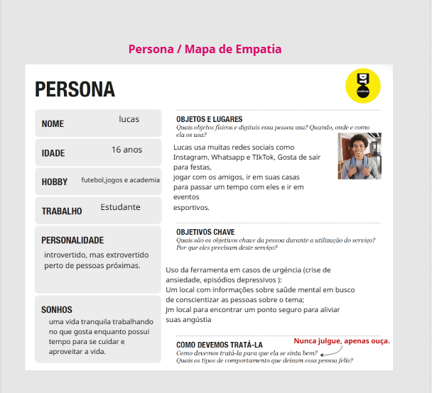

# Product Design

Nesse momento, vamos transformar os insights e validações obtidos em soluções tangíveis e utilizáveis. Essa fase envolve a definição de uma proposta de valor, detalhando a prioridade de cada ideia e a consequente criação de wireframes, mockups e protótipos de alta fidelidade, que detalham a interface e a experiência do usuário.

## Histórias de Usuários

Com base na análise das personas foram identificadas as seguintes histórias de usuários:

| EU COMO...`Lucas` | QUERO/PRECISO ...`Ferramenta`        | PARA ...`MOTIVO/VALOR`               |
| --------------------- | ------------------------------------------ | -------------------------------------- |
| Usuário do sistema   | Informações sobre saúde mental     | Local/Site para encontrar um ponto seguro|
| Administrador         | Conscientizar sobre o tema        | Aliviar as Angustias/Desabafar |

## Proposta de Valor


## Requisitos

As tabelas que se seguem apresentam os requisitos funcionais e não funcionais que detalham o escopo do projeto.

### Requisitos Funcionais

| ID     | Descrição do Requisito                                   | Prioridade |
| ------ | ---------------------------------------------------------- | ---------- |
| RF-001 | Permitir que o usuário tenha um lugar seguro para cuidar da saude mental | ALTA       |
| RF-002 | Conversar com profissionais ou conhencer novas pessoas | ALTA    |

### Requisitos não Funcionais

| ID      | Descrição do Requisito                                                              | Prioridade |
| ------- | ------------------------------------------------------------------------------------- | ---------- |
| RNF-001 | O sistema deve ser responsivo para rodar em todos os dispositivos | MÉDIA     |
| RNF-002 | Deve processar requisições do usuário em poucos segundos para ter um contato maior com os atendentes | MÉDIA     |

> 
## Projeto de Interface

Artefatos relacionados com a interface e a interacão do usuário na proposta de solução.

### Wireframes

Estes são os protótipos de telas do sistema.

### tela de login
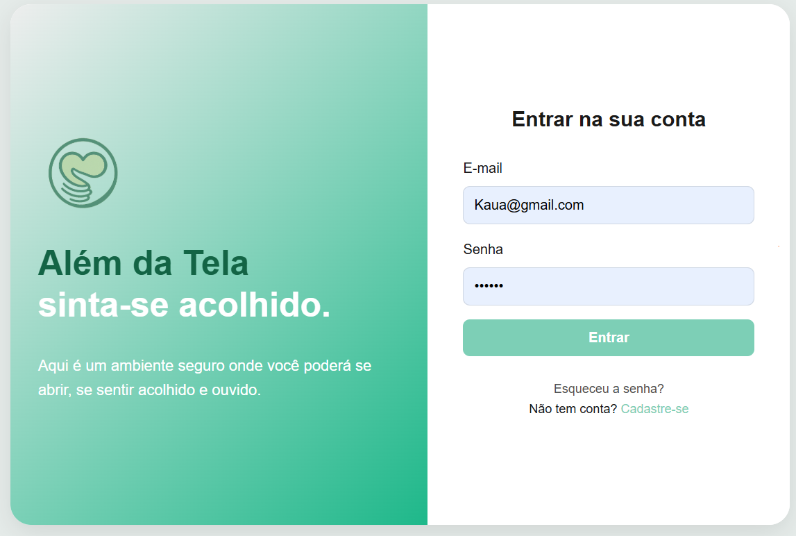
### página principal
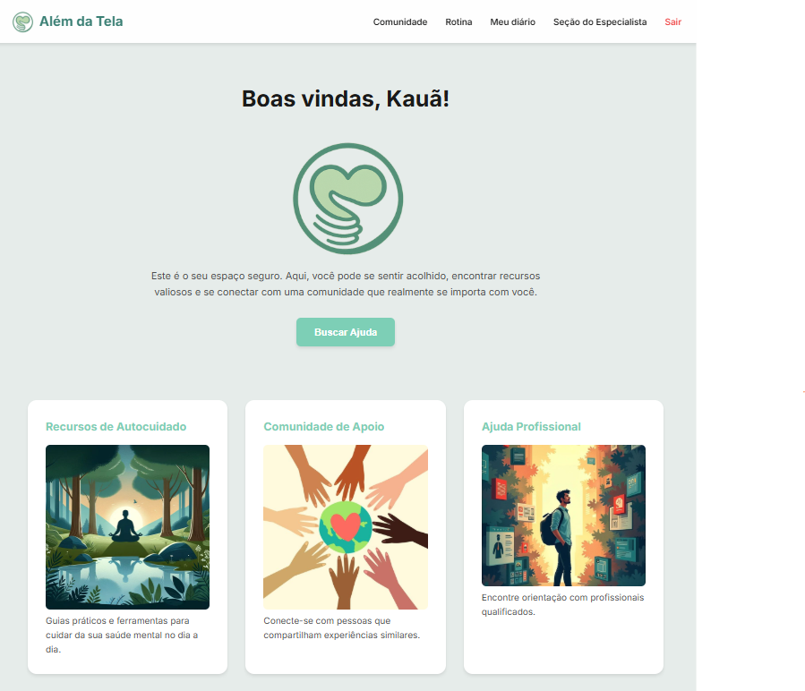
### comunidade
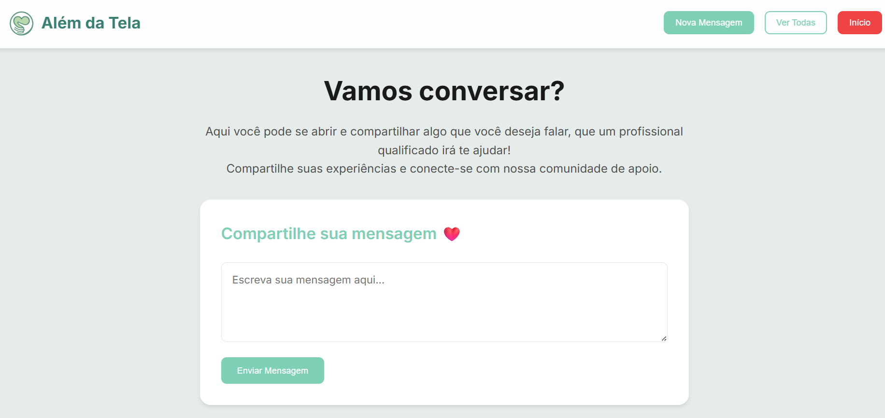
### minhas respostas
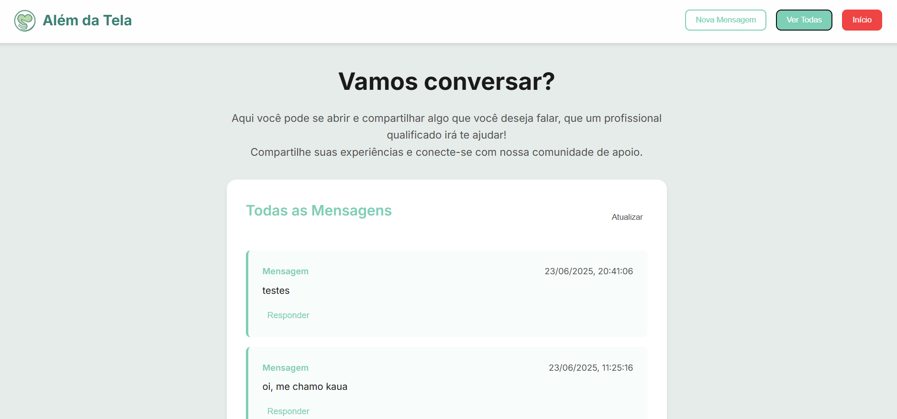
### rotina
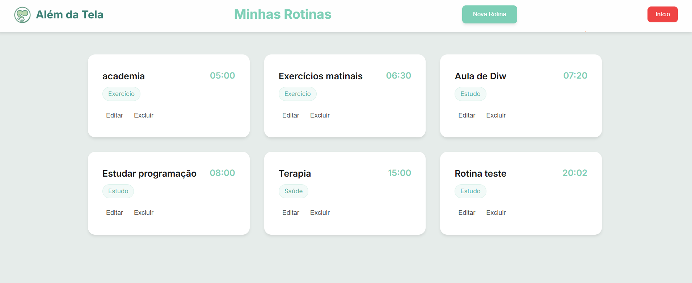
### nova rotina
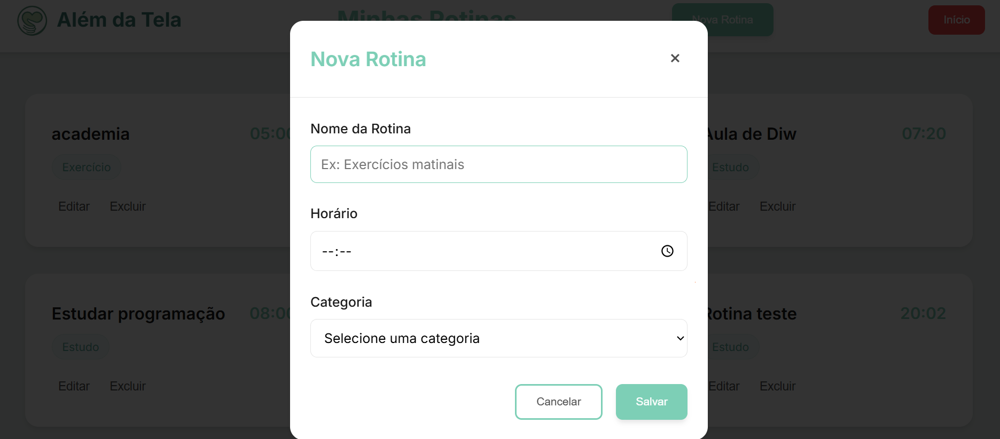
### diario
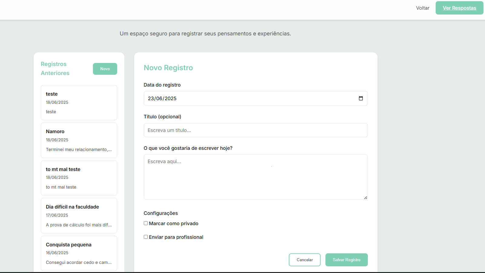
### area especialista
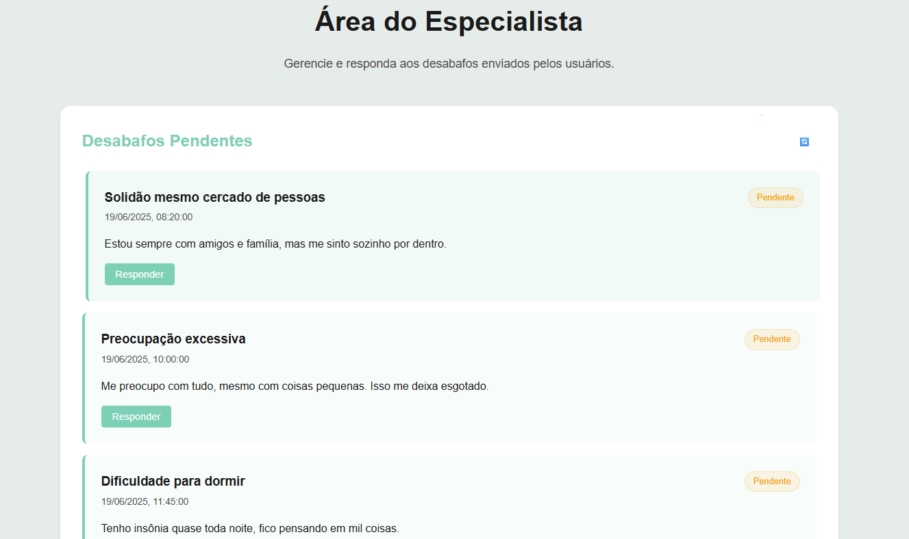
### resposta do especialista
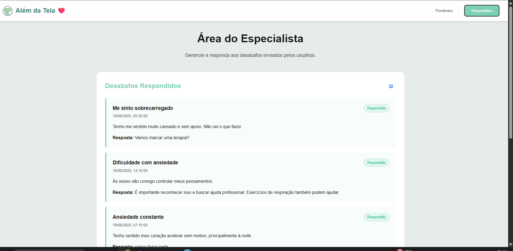


### User Flow

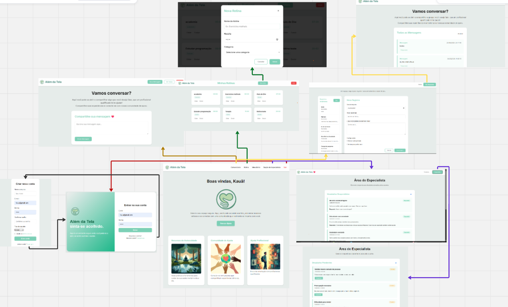


### Protótipo Interativo

**✳️✳️✳️ COLOQUE AQUI UM IFRAME COM SEU PROTÓTIPO INTERATIVO ✳️✳️✳️**

✅ [Protótipo Interativo (MarvelApp)](https://marvelapp.com/prototype/4hd6091?emb=1&iosapp=false&frameless=false)  ⚠️ EXEMPLO ⚠️

> ⚠️ **APAGUE ESSA PARTE ANTES DE ENTREGAR SEU TRABALHO**
>
> Um protótipo interativo apresenta o projeto de interfaces e permite ao usuário navegar pelas funcionalidades como se estivesse lidando com o software pronto. Utilize as mesmas ferramentas de construção de wireframes para montagem do seu protótipo interativo. Inclua o link para o protótipo interativo do projeto.

# Metodologia

Detalhes sobre a organização do grupo e o ferramental empregado.

## Ferramentas

Relação de ferramentas empregadas pelo grupo durante o projeto.

| Ambiente                    | Plataforma | Link de acesso                                     |
| --------------------------- | ---------- | -------------------------------------------------- |
| Processo de Design Thinking | Miro       | https://miro.com/XXXXXXX ⚠️ EXEMPLO ⚠️        |
| Repositório de código     | GitHub     | https://github.com/XXXXXXX ⚠️ EXEMPLO ⚠️      |
| Hospedagem do site          | Render     | https://site.render.com/XXXXXXX ⚠️ EXEMPLO ⚠️ |
| Protótipo Interativo       | MarvelApp  | https://marvelapp.com/XXXXXXX ⚠️ EXEMPLO ⚠️   |
|                             |            |                                                    |

> ⚠️ **APAGUE ESSA PARTE ANTES DE ENTREGAR SEU TRABALHO**
>
> Liste as ferramentas empregadas no desenvolvimento do projeto, justificando a escolha delas, sempre que possível. Inclua itens como: (1) Editor de código, (2) )ferramentas de comunicação, (3) )ferramentas de diagramação, (4) )plataformas de hospedagem, entre outras.

## Gerenciamento do Projeto

Divisão de papéis no grupo e apresentação da estrutura da ferramenta de controle de tarefas (Kanban).


> ⚠️ **APAGUE ESSA PARTE ANTES DE ENTREGAR SEU TRABALHO**
>
> Nesta parte do documento, você deve apresentar  o processo de trabalho baseado nas metodologias ágeis, a divisão de papéis e tarefas, as ferramentas empregadas e como foi realizada a gestão de configuração do projeto via GitHub.
>
> Coloque detalhes sobre o processo de Design Thinking e a implementação do Framework Scrum seguido pelo grupo. O grupo poderá fazer uso de ferramentas on-line para acompanhar o andamento do projeto, a execução das tarefas e o status de desenvolvimento da solução.
>
> **Orientações**:
>
> - [Sobre Projects - GitHub Docs](https://docs.github.com/pt/issues/planning-and-tracking-with-projects/learning-about-projects/about-projects)
> - [Gestão de projetos com GitHub | balta.io](https://balta.io/blog/gestao-de-projetos-com-github)
> - [(460) GitHub Projects - YouTube](https://www.youtube.com/playlist?list=PLiO7XHcmTsldZR93nkTFmmWbCEVF_8F5H)
> - [11 Passos Essenciais para Implantar Scrum no seu Projeto](https://mindmaster.com.br/scrum-11-passos/)
> - [Scrum em 9 minutos](https://www.youtube.com/watch?v=XfvQWnRgxG0)

# Solução Implementada

Esta seção apresenta todos os detalhes da solução criada no projeto.

## Vídeo do Projeto

O vídeo a seguir traz uma apresentação do problema que a equipe está tratando e a proposta de solução. ⚠️ EXEMPLO ⚠️

[](https://www.youtube.com/embed/70gGoFyGeqQ)

> ⚠️ **APAGUE ESSA PARTE ANTES DE ENTREGAR SEU TRABALHO**
>
> O video de apresentação é voltado para que o público externo possa conhecer a solução. O formato é livre, sendo importante que seja apresentado o problema e a solução numa linguagem descomplicada e direta.
>
> Inclua um link para o vídeo do projeto.

## Funcionalidades

Esta seção apresenta as funcionalidades da solução.Info

##### Funcionalidade 1 - Cadastro de Contatos ⚠️ EXEMPLO ⚠️

Permite a inclusão, leitura, alteração e exclusão de contatos para o sistema

* **Estrutura de dados:** [Contatos](#ti_ed_contatos)
* **Instruções de acesso:**
  * Abra o site e efetue o login
  * Acesse o menu principal e escolha a opção Cadastros
  * Em seguida, escolha a opção Contatos
* **Tela da funcionalidade**:


> ⚠️ **APAGUE ESSA PARTE ANTES DE ENTREGAR SEU TRABALHO**
>
> Apresente cada uma das funcionalidades que a aplicação fornece tanto para os usuários quanto aos administradores da solução.
>
> Inclua, para cada funcionalidade, itens como: (1) titulos e descrição da funcionalidade; (2) Estrutura de dados associada; (3) o detalhe sobre as instruções de acesso e uso.

## Estruturas de Dados

Descrição das estruturas de dados utilizadas na solução com exemplos no formato JSON.Info

##### Estrutura de Dados - Contatos   ⚠️ EXEMPLO ⚠️

Contatos da aplicação

```json
  {
    "id": 1,
    "nome": "Leanne Graham",
    "cidade": "Belo Horizonte",
    "categoria": "amigos",
    "email": "Sincere@april.biz",
    "telefone": "1-770-736-8031",
    "website": "hildegard.org"
  }
  
```

##### Estrutura de Dados - Usuários  ⚠️ EXEMPLO ⚠️

Registro dos usuários do sistema utilizados para login e para o perfil do sistema

```json
  {
    id: "eed55b91-45be-4f2c-81bc-7686135503f9",
    email: "admin@abc.com",
    id: "eed55b91-45be-4f2c-81bc-7686135503f9",
    login: "admin",
    nome: "Administrador do Sistema",
    senha: "123"
  }
```

> ⚠️ **APAGUE ESSA PARTE ANTES DE ENTREGAR SEU TRABALHO**
>
> Apresente as estruturas de dados utilizadas na solução tanto para dados utilizados na essência da aplicação quanto outras estruturas que foram criadas para algum tipo de configuração
>
> Nomeie a estrutura, coloque uma descrição sucinta e apresente um exemplo em formato JSON.
>
> **Orientações:**
>
> * [JSON Introduction](https://www.w3schools.com/js/js_json_intro.asp)
> * [Trabalhando com JSON - Aprendendo desenvolvimento web | MDN](https://developer.mozilla.org/pt-BR/docs/Learn/JavaScript/Objects/JSON)

## Módulos e APIs

Esta seção apresenta os módulos e APIs utilizados na solução

**Images**:

* Unsplash - [https://unsplash.com/](https://unsplash.com/) ⚠️ EXEMPLO ⚠️

**Fonts:**

* Icons Font Face - [https://fontawesome.com/](https://fontawesome.com/) ⚠️ EXEMPLO ⚠️

**Scripts:**

* jQuery - [http://www.jquery.com/](http://www.jquery.com/) ⚠️ EXEMPLO ⚠️
* Bootstrap 4 - [http://getbootstrap.com/](http://getbootstrap.com/) ⚠️ EXEMPLO ⚠️

> ⚠️ **APAGUE ESSA PARTE ANTES DE ENTREGAR SEU TRABALHO**
>
> Apresente os módulos e APIs utilizados no desenvolvimento da solução. Inclua itens como: (1) Frameworks, bibliotecas, módulos, etc. utilizados no desenvolvimento da solução; (2) APIs utilizadas para acesso a dados, serviços, etc.

# Referências

As referências utilizadas no trabalho foram:

* SOBRENOME, Nome do autor. Título da obra. 8. ed. Cidade: Editora, 2000. 287 p ⚠️ EXEMPLO ⚠️

> ⚠️ **APAGUE ESSA PARTE ANTES DE ENTREGAR SEU TRABALHO**
>
> Inclua todas as referências (livros, artigos, sites, etc) utilizados no desenvolvimento do trabalho.
>
> **Orientações**:
>
> - [Formato ABNT](https://www.normastecnicas.com/abnt/trabalhos-academicos/referencias/)
> - [Referências Bibliográficas da ABNT](https://comunidade.rockcontent.com/referencia-bibliografica-abnt/)
